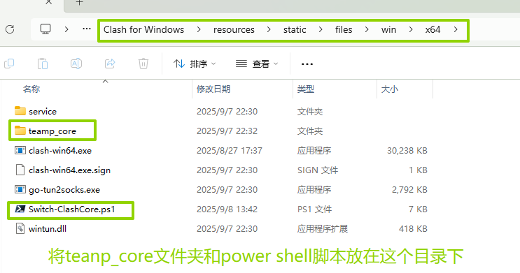
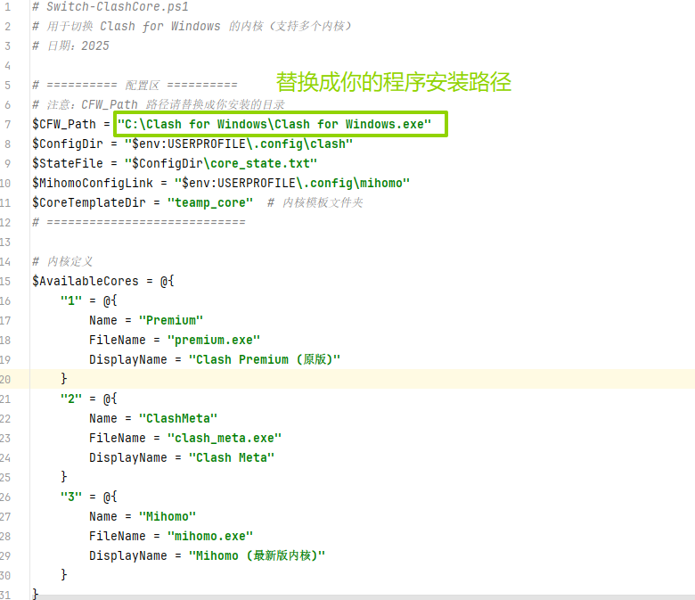
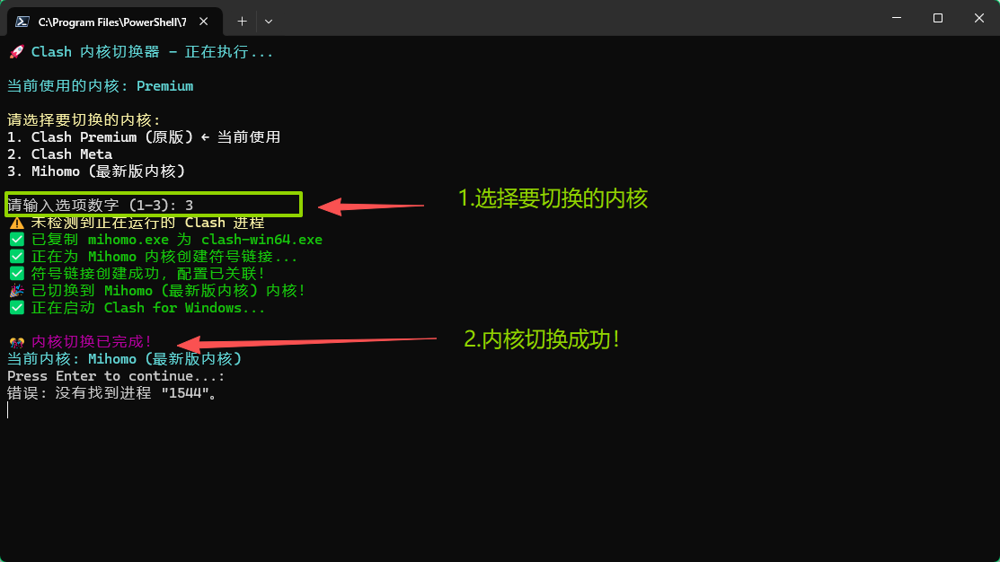

### language

- [中文](README.md)

- [英文](README_en.md)

### 本项目参考了[kayaladream/Clash-Core-Change](https://github.com/kayaladream/Clash-Core-Change) ，并在之前的基础上进行了一些改进

- 虽说有很多clash的衍生客户端，但还是有多人用惯了clash for windows
- 以下演示基于版本：**Clash.for.Windows-0.20.39-win**

### 使用方法

1. 下载并将**teamp_core**文件夹，放到文件夹（C:\Clash for Windows\resources\static\files\win\x64）中
2. 将**Switch-ClashCore.ps1**也放在安装目录的（C:\Clash for Windows\resources\static\files\win\x64）中

> 注：前面路径替换成你程序的实际安装目录

1. 检查安装路径修改*Switch-ClashCore.ps1*里面程序指向的路径

   

2. 查看原版内核版本

   

   

3. 双击使用**power shell**运行**Switch-ClashCore.ps1** 脚本

   - 注意：执行操作时尽量先关闭**clash for windows**的后台，否则可能导致内核文件占用，内核文件切换失败！

   - 执行切换内核的操作（如图所示）

   

4. 打开程序查看是否正确读取内核

### 完成！

### 【参考引用】

> [1]https://github.com/kayaladream/Clash-Core-Change/releases/tag/v2.0
> [2]mihomo内核下载地址:https://github.com/MetaCubeX/mihomo/releases
> [3]旧版本meta内核：https://github.com/MetaCubeX/mihomo/tree/v1.16.0

---

## 免责声明 (Disclaimer)

**重要提示：请在使用本项目前仔细阅读以下免责声明。**

1.  **项目性质**：本项目是一个基于 [Clash-Core-Change](https://github.com/kayaladream/Clash-Core-Change) 开发的、用于学习和研究目的的 Clash 内核管理与更换脚本。本项目及其作者与 Clash 官方及其核心开发团队无关。

2.  **仅供学习交流**：本项目所有代码和内容均仅供技术学习、交流和研究之用。您不得将本项目用于任何商业目的或营利性活动。

3.  **合法合规使用**：您在使用本项目的脚本及由此下载、安装的任何软件时，必须严格遵守您所在国家或地区的法律法规。**严禁使用本项目进行任何违反法律、法规或侵犯他人合法权益的活动**，包括但不限于：
    *   未经授权访问他人网络或数据。
    *   破坏网络通信安全。
    *   绕过合法的网络访问限制。

4.  **非责任声明**：作者对本项目的代码安全性、稳定性和功能性不作任何明示或默示的担保。**使用本项目所产生的任何直接或间接风险及后果（包括但不限于软件故障、数据丢失、设备问题、法律风险等）均由使用者自行承担**，**作者概不负责**。

5.  **开源协议**：本项目基于 [MIT License](LICENSE) 开源。这意味着您可以自由地使用、复制、修改和分发本项目的代码，但**必须包含原始的版权声明和本免责声明**。

**如果您使用了本项目，即表示您已充分阅读、理解并同意本免责声明的全部内容。您应为自己使用本项目的所有行为负责。**